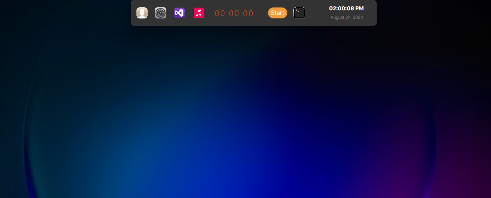

# 🚀 Dynamic Island Clone for macOS - The Ultimate Desktop Experience

Welcome to **THE** game-changer in desktop enhancements! Our Dynamic Island Clone isn’t just an app—it’s a **revolution** in UI design, bringing the innovative, sleek, and **jaw-droppingly gorgeous** macOS feature to every platform, from Windows to Linux. Built with Avalonia and powered by .NET, this app is more than just a clone; it's a **statement** that your desktop deserves nothing but the best.

## Why This Project Is a Big Deal

- **Unmatched Elegance**: We've meticulously replicated the beauty and functionality of macOS's Dynamic Island, delivering an experience so smooth you'll forget you're not on a Mac.
- **Cross-Platform Perfection**: This isn't just for macOS fans. We've ensured that **everyone**—whether on Windows or Linux—can bask in the glory of this stunning UI element.
- **Customizable to Your Core**: Make it yours. Tweak, modify, and perfect the interface until it mirrors your soul.




## Getting Started

### Prerequisites

Before diving into the future, make sure you've got:

- The latest [.NET SDK](https://dotnet.microsoft.com/download) (because only the best will do).
- Visual Studio or Visual Studio Code (preferably with a nice dark theme, because coolness matters).

### Installation

1. **Clone Perfection**:
    ```bash
    git clone https://github.com/Gani-23/Dynamic_Island.git
    cd Dynamic_Island
    ```

2. **Restore Dependencies Like a Pro**:
    ```bash
    dotnet restore
    ```

3. **Build with Brilliance**:
    ```bash
    dotnet build
    ```

4. **Run the Future**:
    ```bash
    dotnet run
    ```

### Building for Release

When you’re ready to share this marvel with the world:

```bash
dotnet publish -c Release -r win-x64 --self-contained

```

